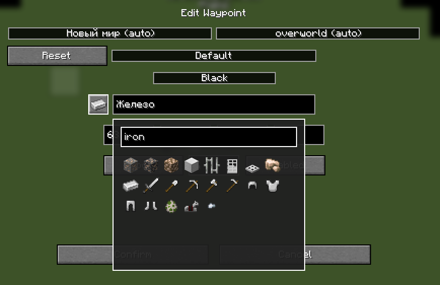

# Xaero Iconize

Xaero Iconize is a client-side addon for **Xaero's Minimap** and **Xaero's World Map** that allows you to use Minecraft items as waypoint icons.

Instead of being limited to waypoint initials, you can choose any registered item from Minecraft or your installed mods and use it as a custom waypoint icon.

## Features

- Assign any registered item as a waypoint icon
- Supports both vanilla and modded items
- Searchable item picker
- Custom icons are saved between game sessions
- Existing waypoint icons are restored when editing a waypoint
- Remove a custom icon and return to the default Xaero waypoint symbol
- Custom icons are displayed:
    - on Xaero's Minimap
    - as in-world waypoint markers
    - on Xaero's World Map

## Icon Picker

When creating or editing a waypoint, Xaero Iconize adds an icon button next to the waypoint name field.

Click the button to open the item picker and select the item you want to use as the waypoint icon.

The picker includes a search field, so you don't have to scroll through every item installed in the game.

Right-click the icon button to remove the currently assigned custom icon.

## World Map

Custom waypoint icons are also displayed directly on Xaero's World Map.

The original Xaero waypoint background, colors and labels are preserved.

## Requirements

- Minecraft 1.21.1
- NeoForge
- Xaero's Minimap
- Xaero's World Map
- XaeroLib

## Compatibility

Xaero Iconize uses Minecraft's item registry, which means items added by other mods can also be used as waypoint icons.

No additional compatibility layer is required for individual item mods.

## Installation

1. Install NeoForge for Minecraft 1.21.1.
2. Install Xaero's Minimap, Xaero's World Map and XaeroLib.
3. Place Xaero Iconize into your `mods` folder.
4. Launch the game.

## Usage

1. Create a new waypoint or edit an existing one.
2. Click the icon button next to the waypoint name.
3. Search for or select an item.
4. Confirm the waypoint changes.

The selected item will now be used as the waypoint icon.

To restore the default Xaero waypoint symbol, right-click the icon button and confirm the waypoint changes.

## License

This project is licensed under the MIT License.
See the [LICENSE](LICENSE) file for details.